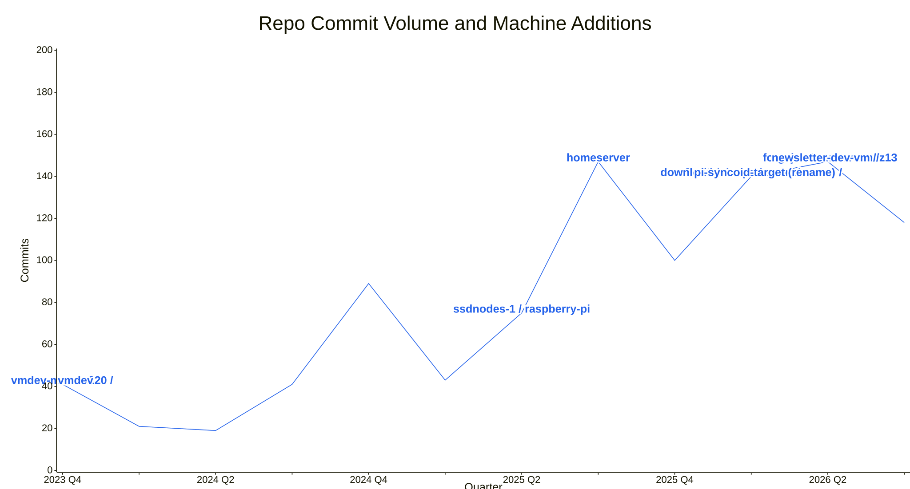

# systems

# update this flake

to update the flake.lock to the current release of nix packages

```shell
nix flake update
```

Afterwards re-run the flake

```shell
sudo nixos-rebuild switch --flake ~/systems-repo-location#MachineName
```


## Docs

- [NixOS ZFS install](docs/nixos-zfs-install.md)

### System flake activity

The chart covers the trailing 36 months (12 quarters) of commits and labels the
quarter when each machine was added to `nixosConfigurations`. Removed machines
remain in the historical timeline.



[Mermaid source](docs/system-flake-commit-volume.mmd)

Regenerate the chart data (and optionally the SVG) with:

```shell
scripts/generate-system-flake-chart.sh               # rewrite docs/system-flake-commit-volume.mmd
scripts/generate-system-flake-chart.sh --render      # render the SVG and auto-fit the labels
scripts/generate-system-flake-chart.sh --all         # chart full history since the fork
scripts/generate-system-flake-chart.sh --quarters 8  # override the most recent 12-quarter window
```

The script derives quarterly commit volume from git author dates
(`ce788b1^..master`) and appends the machine-addition labels from a table in the
script. Machine labels only appear when their add-quarter falls inside the
window. Pass a different ref as an argument to chart another branch or commit.

